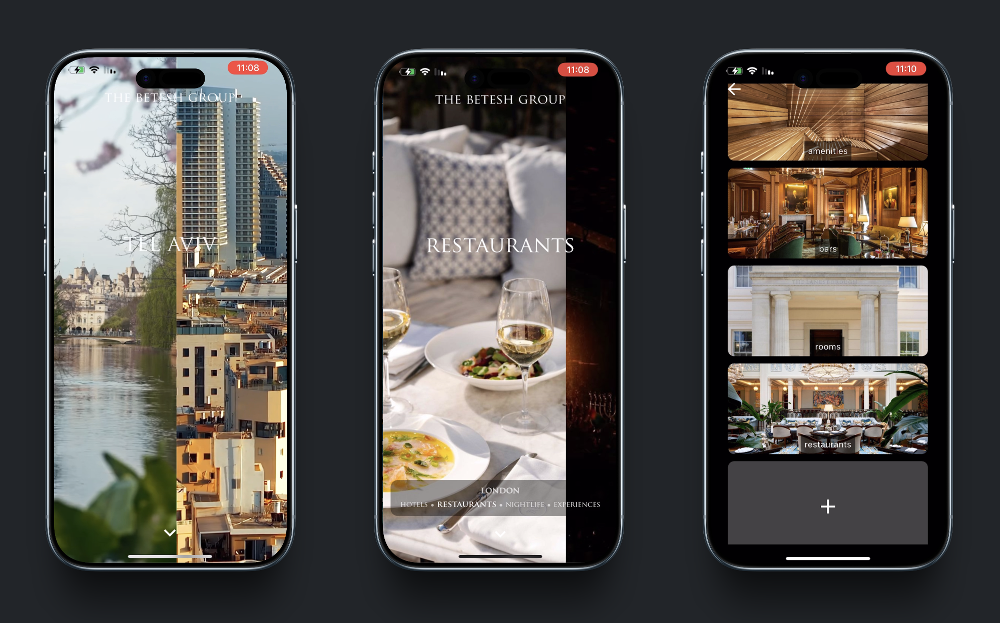
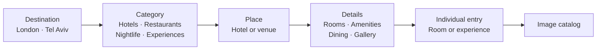
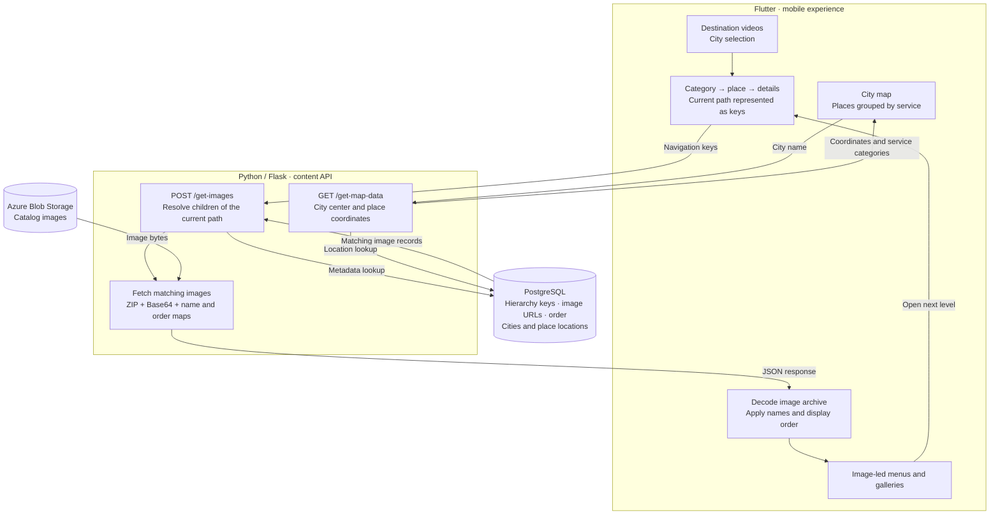
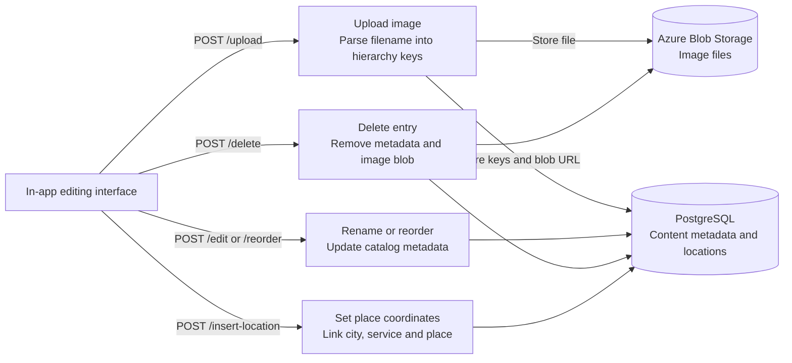

  <h1>The Betesh Group · Travel App</h1>
  
<strong>A bespoke mobile travel catalog, designed and built for a company’s needs</strong>

  
Flutter · Dart · Python · Flask · PostgreSQL · Azure Blob Storage

  
  
<a href="https://www.youtube.com/shorts/z2f5DMXWMnA">Watch the app walkthrough →</a>

> **Ownership:** The application is proprietary to **The Betesh Group**. This repository is a portfolio showcase of my internship work; it does not distribute the application’s source code or grant rights to use, reproduce, or redistribute the company’s software, branding, or content.

## Built from a company brief

During my internship at **The Betesh Group**, I designed and built this product around the company’s stated needs. I translated their requirements into the app’s visual design, browsing structure, and content-management workflow, then implemented the mobile frontend and backend.

The result is a branded, image-led travel catalog: users explore destinations, discover hotels, restaurants, nightlife, and experiences, and browse the details of individual places. The interface pairs destination videos with full-screen imagery and a consistent visual identity.

## The product experience

- **Explore progressively:** move from a city to a category, a place, and its rooms, amenities, dining, or image galleries.
- **Find places geographically:** view city and place locations on a map, organized by service category.
- **Maintain the catalog in the app:** upload imagery, rename entries, reorder content, delete items, and attach place coordinates through the editing interface.

## Architecture · Navigation

The catalog follows a tree: each selection adds a key to the current path, and the next page displays its children.

## Architecture · Content delivery

The Flutter app sends the current navigation path to Flask. PostgreSQL identifies the next level of content and its display order; the backend retrieves the corresponding images from Azure Blob Storage and packages them for the app.

### A hierarchy driven by content

Underscore-separated upload filenames encode up to six levels of the catalog. For example, `london_hotels_the lanesborough_rooms_the royal suite.jpg` maps to a destination, category, hotel, room section, and room entry. The same path structure drives the backend’s child-content queries and the frontend’s navigation.

## Architecture · Content management

The editing interface connects catalog maintenance to the same content model used for browsing. Images and their metadata are stored separately, while ordering and location data remain in PostgreSQL.

The walkthrough documents the internship product. Its original deployment used company-managed cloud services; the video presents the experience independently of their current availability.
